+++
title = "Stratified Negation In Datalog"
description = "A description of how the technique of stratified negation is applied in Datalog"
date = 2024-11-15

[taxonomies]
tags = ["parsing negation", "fixed-point parsing"]

[extra]
repo_view = true
+++

# Stratified Negation

In Datalog, "stratified negation" starts with turning rules into dependency
graphs. A head depends on its clauses.

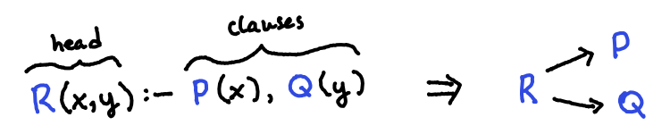

A dependency can be either positive (+) or negative (-) depending on whether the
clause is negated or not.

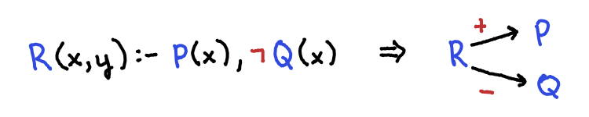

Next, you group the "strongly connected components" (SCCs).  An SCC is a
collection of vertices with a path between any two vertices in the SCC. In other
words, an SCC is a sort of "cycle grouping".

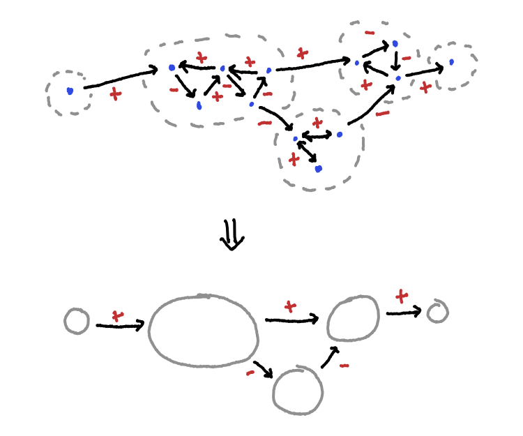

Note that a single vertex can be its own SCC if it isn't a part of any cycles.

The next step in using stratified negation is to evaluate SCC's in dependence
order. Every graph of SCCs form an acyclic directed graph (ADG) with "sources"
and "sinks". A source doesn't have anything dependent on it, while a sink isn't
dependent on anything.

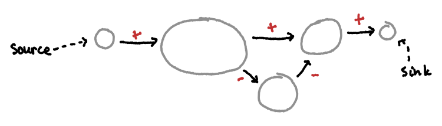

We want to start by evaluating things that aren`t dependent on anything else. So
we start by doing fixed-point evaluation on the sinks. Fixed-point evaluation
will be described a bit later.

Once we have performed fixed-point evaluation on the SCCs, we remove them from
the graph. We now have new sinks that need to be evaluated.

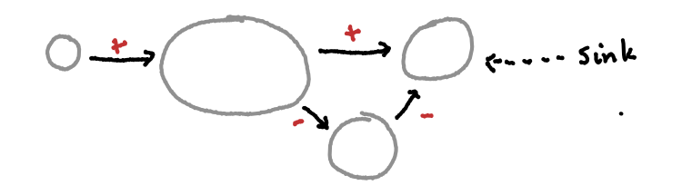

We keep evaluating sinks and removing them from the graph until all SCCs have
been evaluated.

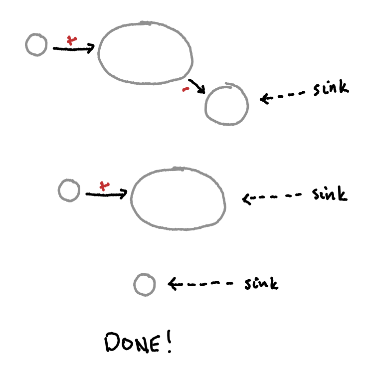

At this point, we have successfully evaluated all of our rules.


## Fixed-Point Evaluation

Up to this point, we haven`t really discussed what "evaluation" really means.
With a datalog program, we start out with a collection of facts and some rules
defining how we can derive more facts. For example, consider the following
program:

```prolog
A("a")  % a fact
B(x) :- A(x)  % a rule
```

The facts are known as our "extensional database" (EDB). The rules help us
derive our "intensional database" (IDB). In this example, our EDB (facts
database) is `{A("a")}`. This is true throughout the evaluation of the program.
Our IDB (derivation database) is what changes throughout the evaluation of the
program.

Our IDB starts out empty: `{}`. Then, after the evaluation of `B(x) :- A (x)` on
the current EDB and IDB, it finds `A("a")` and
derives `B("a")`. Thus, our IDB becomes `{B("a")}`.

Now, consider the following program.

```prolog
parent("john", "steve")  % John is a parent of Steve
parent("joe", "john")

ancestor(X, Y) :- parent(X, Y)
ancestor(X, Y) :- parent(X, Z), ancestor (Z, Y)

descendant(X, Y):- ancestor(Y,X)
```

Note that the dependency graph of this program is as follows. (From here on out,
the `parent` fact will be abbreviated as `p`, the `ancestor` rule will be
abbreviated as `a` , and the `descendant` rule will be abbreviated as `d` when
not referring to the original code).

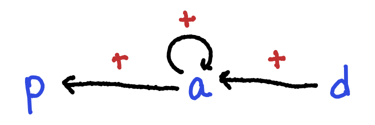

`d` depends on `a` , and `a` depends on itself and `p`. `p` does not depend on
anything because it is a fact.

Running the rules once with IDB `{}` would produce:

```prolog
ancestor(X, Y) :- parent(X, Y)  % => {a("john", "steve"), a("joe", "john")}
ancestor(X, Y) :- parent(X, Z), ancestor(Z, Y)  % => {}

descendant(X, Y) :- ancestor(Y, X)  % => {}
```

where `ancestor` is shortened to `a` . Notice that the second and third rules
didn't produce any results. This is because they both depend on the `ancestor`
rule, which hadn`t been previously evaluated.

Because we have now run `a`, we can run the rules again with our new IDB
(`{a("john", "steve"), a("joe! "john")}`) and get new results:

```prolog
ancestor(X, Y) :- parent(X, Y)
    % => {a("john", "steve"), a("joe", "john")}

ancestor(X, Y) :- parent(X, Z), ancestor(Z, Y)
    % => {a("joe", "steve")}

descendant(X, Y) :- ancestor(Y, X) 
    % => {d("steve", "john"), d("john", "joe")}
```

We now have a new IDB:

```prolog
{
    a("john", "steve"),
    a("joe", "john"),
    a("joe", "steve"),
    d("steve", "john"),
    d("john", "joe")
}
```

We can run the rules again with our updated IDB.

```prolog
ancestor(X, Y) :- parent (X, Y)
    % => {a("john", "steve"), a("joe", "john")}
	
ancestor(X, Y) :- parent(X, Z), ancestor(Z, Y)
    % => {a("joe", "steve")}

descendant(X, Y) :- ancestor(Y, X)
    % => {d("steve", "john"), d("john", "joe"), d("steve", "joe")}
```

This run results in the IDB:

```prolog
{
    a("john", "steve"),
    a("joe", "john"),
    a("joe", "steve"),
    d("steve", "john"),
    d("john", "joe"),
    d( "steve", "joe")
}
```

Running this through the rules again doesn`t produce any new results, so we can
conclude that we have reached a "fixed point" and have therefore derived
everything possible from our facts.  This is the essence of fixed-point
evaluation.

However, notice that we can actually perform fewer rule evaluations if we take
advantage of the dependencies.

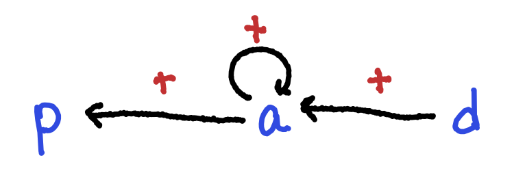

`p` doesn't depend on anything, so we can evaluate it immediately. Once it has
reached a fixed point, we know that it will never change. Reaching a fixed point
is trivial for `p` since it is a set of facts. Evaluating facts will always
produce a constant result, so they immediately reach a fixed point.

`a`now only has itself as an unevaluated dependency. Because it is dependent on
itself, we will need to evaluate it repeatedly until it doesn't produce any new
results and has thus reached a fixed point.

`d` now has no unevaluated dependencies. We can evaluate it once to reach a
fixed point, since the results of it's evaluation do not affect any of its
dependencies.

We have now finished the evaluation of our program. Note that we only ran `d`
once! While this isn't as valuable in this small program, this can bring massive
speedups for programs with many rules and dependencies.


## Stratified Evaluation

The process that we have described is what we will refer to as "stratified
evaluation". Put simply, we break the program into "stratifications" which are
the strongly connected components (SCCs) that we mentioned earlier.

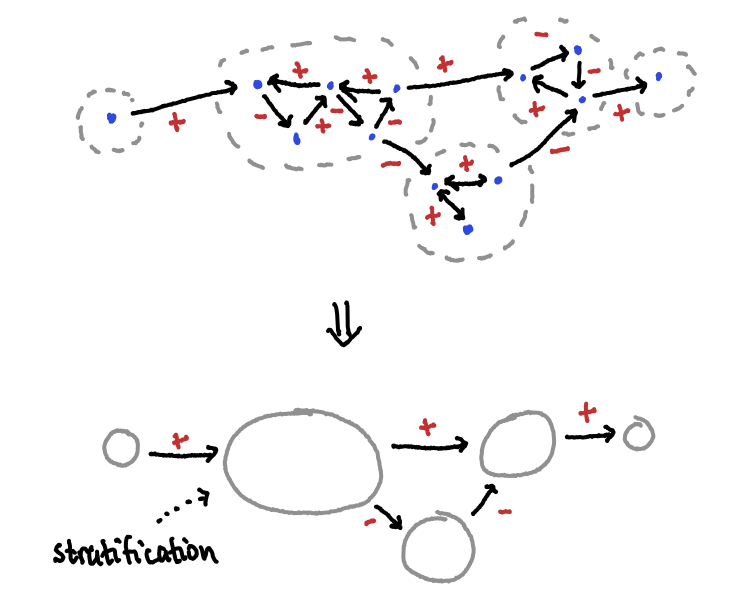

We then mark the stratifications from sink to source, following the rule that a
stratification must have a higher number than every stratification that it
depends on. (The reason for this rule is that the markings represent the order
of evaluation, and we want all dependencies to be evaluated before a
stratification itself is evaluated)

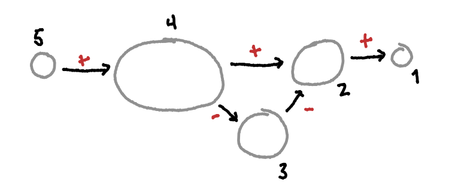

Finally, you evaluate each of the stratification in the order marked. Starting
with stratification 1, you run the stratification until it reaches a fixed
point. Then you move on to stratification 2. You repeat this process until you
finish the final stratification.  At this point you have successfully evaluated
the full program.

Note that it`s possible to have multiple possible stratification
numberings for a given program, such as the one shown below.

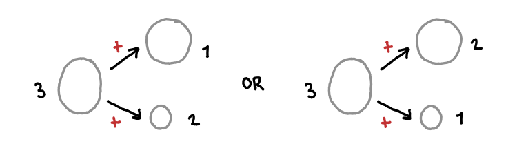


## Negation

We have established how to evaluate Datalog problems in an effective way.
However, though we've briefly mentioned that negation exists, we haven't
described how it is evaluated.

How do you deal with
absence of truth? In the case of Datalog, we simply
base it off of the information that we have. Consider the
following program

```prolog
store("walmart")
store("target")

open("walmart")

closed(X) :- store(X), ¬open(X)
```

This program would start by evaluating facts and creating the EDB:
`{store("walmart"), store("target"), open("walmart")}`.  Then, it would evaluate
the `closed` rule. This would find all X's that are stores
(`{"walmart", "target"}`). Then, it would find all X's that where `open(X)` is
in the database (`{open("walmart")}`) and remove those from the possibilities,
resulting in the final result of `{"target"}`.

This generally works. However, we need to establish one rule:
negation cannot be a dependency in a cycle. To see why,
consider the following program:

```prolog
person("john")

adult(X) :- person(X), ¬child(X)
child(X) :- person(X), ¬adult(X)
```

In evaluating this program, we would first produce one fact: `{person("john")}`.
This is okay. The problem comes when we attempt a fixed-point evaluation of the
`adult` and `child` rules.  The evaluation would be as follows:

```prolog
% = eval 1 =
% DB: {person("john")}
adult(X) :- person(X), ¬child(X) % => {adult("john")}
child(X) :- person(X), ¬adult(X) % => {child("john")}

% = eval 2 =
% DB: {person("john"), adult("john"), child("john")}
adult(X) :- person(X), ¬child(X) % => {}
child(X) :- person(X), ¬adult(X) % => {}

% = eval 3 = %
% DB: {person("john")}
adult(X) :- person(X), ¬child(X) % => {adult("john")}
child(X) :- person(X), ¬adult(X) % => {child("john")}

% = eval 4 =
% DB: {person("john"), adult("john"), child("john")}
adult(X) :- person(X), ¬child(X) % => {}
child(X) :- person(X), ¬adult(X) % => {}

% ... and so on...
```

This fixed-point evaluation will continue on forever, oscillating between "john"
being both an adult and a child, and "john" being neither an adult nor a child.

Because of problems like this, we need to only allow negative dependencies
*between* cycles and not *within* cycles. This ensures that negative
dependencies produce fixed results.

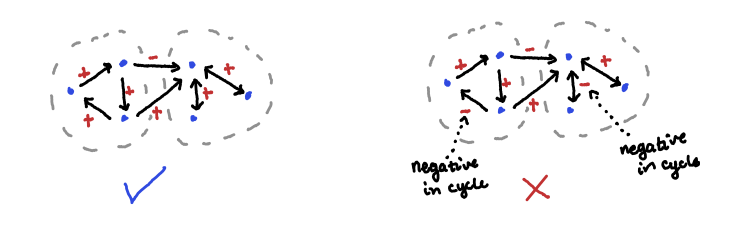


## Conclusion

In review, we've seen how datalog programs can be made into dependency graphs.
We have then seen how those graphs can further be grouped into strongly
connected components, or SCCs. These SCCs contain cyclical dependencies. Next,
we observed how to evaluate a dependency graph using fixed-point evaluation,
first on the whole graph, then on SCCs. Finally, we`ve seen how negation factors
into fixed-point evaluation.


## Sources

Here are some resources that helped me learn about stratified negation in datalog:

* [CS 784 Lecture: Datalog with
  Negation](https://pages.cs.wisc.edu/~paris/cs784-s17/lectures/lecture9.pdf)

* [Negation in Datalog (YouTube) - Knowledge Based Systems, TU
  Dresden](https://youtu.be/GNS-6W3s8KY?si=YTADVU6TFOhYnG5M)
