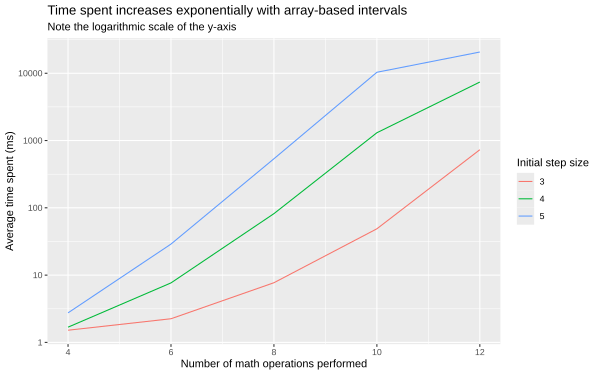
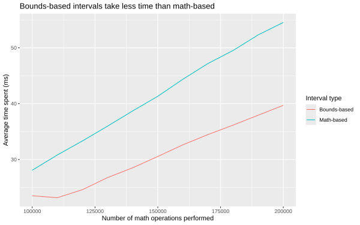
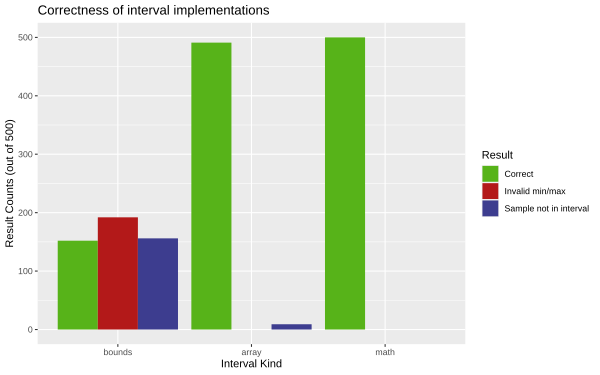

+++
title = "Interval Arithmetic Analysis"
description = "An analysis of different implementations of interval arithmetic"
date = 2025-11-12

[taxonomies]
tags = ["oneil", "nim", "benchmark", "analysis", "interval-arithmetic"]

[extra]
repo_view = true
+++

As a part of building [Oneil](https://github.com/careweather/oneil),
I was tasked with figuring out how interval
arithmetic would be handled during evaluation. Here's my analysis.
The full source code can be found
[on Github](https://github.com/pixilcode/interval-arithmetic-analysis).

# Approaches

We discussed three different approaches.

## 1. Bounds-based Intervals

This is what the Python implementation of Oneil
uses. It is a naive approach that mainly handles the simple cases. It only
performs operations on the min and max bounds, while ignoring any of the
values in between. (This approach was sufficient for the initial
development of Oneil)

## 2. Math-based Intervals

This approach takes a more mathematical approach. Similar to the bounds-based
approach, only the min and the max are stored. However, rather than a naive
implementation, this approach reasons about interval "signed-ness". For
example, the following table represents the evaluation of multiplication
`(a, b) * (c, d)`:

```
          |   Mixed    |  Negative  |  Positive  |  Zero
----------|------------|------------|------------|-------
 Mixed    |     *1     | [b*c, a*c] | [a*d, b*d] | {0}
 Negative | [a*d, a*c] | [b*d, a*c] | [a*d, b*c] | {0}
 Positive | [b*c, b*d] | [b*c, a*d] | [a*c, b*d] | {0}
 Zero     |     {0}    |     {0}    |     {0}    | {0}

*1 (min(a*d, b*c}, max{a*c, b*d})
```

The implementation in this project is based mainly off of the
[source code of the `inari` crate](https://docs.rs/crate/inari/2.0.0/source/).

## 3. Array-based Intervals

This approach represents an interval as a min, a
max, and a sample of values in between all stored in an array. For example,
the interval `(0.0, 2.0)` might be represented as the array
`[0.0, 0.5, 1.0, 1.5, 2.0]`. It could also be represented as
`[0.0, 1.0, 2.0]`. It depends on how granular you want the interval to be.

Arithmetic is then done on each individual value of the array. Binary
operators operate similar to the cartesian product. For example,
`sin([-pi/2, 0.0, pi/2])` would produce `[-1, 0, 1]`, while `[1, 2] * [3, 4]`
would produce `[3, 4, 6, 8]`.

# Theoretical Analysis

From a theoretical standpoint, here are observations about each approach.

## 1. Bounds-based Intervals

**Strengths:**
  - fast
  - small space-requirements
  - simple to implement

**Weaknesses:**
  - can produce incorrect/invalid answers

Bounds-based intervals always perform operations on two float values. That's it.
This means that it's relatively fast, and it doesn't take up a lot of space.
In addition, the operations are simple to implement.

However, because they ignore the values between the bounds,
these intervals can cause issues with operations like `sin(x)` or `x^3`.
For example, given the interval `(-pi, pi)`, `sin((-pi, pi))` would produce
the interval `(0, 0)`, which implies that if the `sin` operation were applied
to any value picked from the interval `(-pi, pi)`, the result would be `0`.
However, this can easily be disproved with `sin(-pi/2) == -1` and
`sin(pi/2) == 1`.

In addition, it doesn't take the "signed-ness" of an interval into account,
meaning it may produce invalid min/max when multiplication and division is
involved.

## 2. Math-based intervals

**Strengths:**
  - correct
  - fast

**Weaknesses:**
  - complex to implement
  - requires custom implementation for operations

Math-based intervals will always produce correct intervals, as long as the operations
are correctly implemented. In addition, while it may be slightly slower than bounds-based
intervals because of branching and analysis, it is still only operating on two values,
which is much faster than array-based intervals.

However, math-based interval operations are complex to implement. The rules for
each operation must be derived from mathematical reasoning, which has the potential for
flaws, especially when each operation must be reasoned about individually.

## 3. Array-based Intervals

**Strengths:**
  - more nuance than bounds-based
  - simple to implement
  - invalid results are impossible
  - can represent a statistical distribution

**Weaknesses:**
  - very slow
  - requires a lot of space
  - limited granularity
  - can still produce incorrect results

Because array-based intervals include points in between the min and the max, they provide
a more nuanced result than bounds-based intervals. In addition, they are about as easy to
implement as bounds-based, since they just require mapping an operation over an array.
Invalid min/max are also impossible, since the min and max of the interval are calculated
as the minimum and maximum value of the array.

The array-based representation can also represent a statistical distribution by the values
contained in the array.

On the other hand, this approach can be very slow when the array size is large, which is
likely for all but the simplest calculations. Because a binary operation produces
the equivalent of a cartesian product, the sizes of arrays can get quite large quickly.

Also, the way to increase granularity is to increase the size of the arrays representing
values. As already mentioned, this can slow down the calculations by a lot, especially
as the increase in size compounds.

And the increased granularity doesn't necessarily
corellate with increased correctness. If all of the values in an array `x` are all
multiples of `pi`, `sin(x)` will still produce an interval that is the equivalent of
`0`.

# Practical Analysis

In order to analyze the approaches from a practical standpoint, I implemented a prototype
for each approach in Nim. The implementations for bounds-based intervals, math-based
intervals, and array based intervals are found in
[`src/interval/boundsinterval.nim`](https://github.com/pixilcode/interval-arithmetic-analysis/tree/main/src/interval/boundsinterval.nim),
[`src/interval/mathinterval.nim`](https://github.com/pixilcode/interval-arithmetic-analysis/tree/main/src/interval/mathinterval.nim), and
[`src/interval/arrayinterval.nim`](https://github.com/pixilcode/interval-arithmetic-analysis/tree/main/src/interval/arrayinterval.nim) respectively.

## Implementation Details

I implemented two tests: the benchmark test and the correctness test.

### Benchmark Test

The benchmark test is a simple two-step process. The first step is to
generate a random list of operations and intervals. The second step is to
those operations and intervals using the provided interval implementation.

The possible operations are limited to addition (`+`), subtraction (`-`),
multiplication (`*`), division (`/`), and sine (`sin`). Generated
intervals will have a minimum between `-100.0` and `100.0`, and
a maximum between `-90.0` and `110.0`.

For arrays, the interval also has an "initial step size" used to generate
it. This determines how many values each generated array has. For example,
an initial step size of 5 might generate the array `[0.0, 0.5, 1.0, 1.5, 2.0]`,
while an initial step size of 3 might generate the array `[0.0, 1.0, 2.0]`.

For simplicity, evaluation uses a stack-based approach. There are two stacks:
the `values` stack and the
`ops` stack. To evaluate, it pops the first operation off the `ops` stack.
Then it pops the needed number of values off the `values` stack (1 value for
`sin`, 2 values for everything else). It evaluates the operation on the
values, then pushes the value back on the stack. This process repeats until
there are no more operations in the `ops` stack. The final value is the
value left on top of the `values` stack.

### Correctness Test

The correctness test is similar to the benchmark test. It generates values and
operations, then evaluates them. The difference is that, for each interval, the
correctness test also generates a "sample value" that exists in that interval
and performs the same operations on those values.

At the end of the evaluation, the test then validates the results in two ways. First,
the test validates that the minimum is less than the maximum. Second, it checks that
the calculated "sample value" is still within the calculated interval.

## Results

### Complexity

The first observation I made as I implemented these approaches is that the math-based
approach is indeed more complex than bounds-based or array-based approaches. Bounds-based
is 33 lines of code and array-based is 56 lines of code, while math-based is 336 lines of
code. This is mainly due to all of the special case handling in the math-based approach.

### Speed

The second observation that I made is that the array-based approach is a lot slower, by
orders of magnitude. When performing 10 operations, it would take whole seconds to complete
when the initial step size was 4 or 5.

This is largely due to the exponential nature of binary operators. Performing 5 addition
operations on arrays with an initial step size of 5 would produce an array with
`5^5` values. Also, because of the way the array-based intervals are implemented,
a binary operation on arrays of size `m` and `n` would have to perform `m * n` operations.
This makes the array-based implementation extremely slow.



On the other hand, the bounds-based and math-based implementations were very fast. They
both completed over 100,000 operations in less than 30 milliseconds. The
math-based intervals were slightly slower than the bounds-based, but the difference was
around 15ms at most.



### Correctness

The final observation that I made is that, in terms of correctness, the math-based implementation
was the only implementation that was correct in 100% of the correctness tests. The array-based
implementation was almost always correct, but it produced samples outside of the interval for 2%
of the runs. Meanwhile, the bounds-based implementation was only correct around 30% of the time.




### Summary

```
-----------------------------------------------------
|              | Complexity |  Speed  | Correctness |
|--------------|------------|---------|-------------|
| Bounds-based | 33 loc     | Fastest | 30%         |
| Math-based   | 336 loc    | Fast    | 100%        |
| Array-based  | 56 loc     | Slow    | 98%         |
-----------------------------------------------------
```

# Conclusion

Of the three factors (complexity, speed, and correctness), speed and correctness are
more important than complexity because they are costs that are paid by an Oneil user
every time they use the language. Complexity, on the other hand, makes the *implementation*
more difficult for the *developer*. This appears to be more of a one-time cost. Once
the implementation of the math is complete and correct, it doesn't need to be updated.
Granted, this assumes that the data structure itself doesn't change much. Either way,
it seems better to pay the cost up front than to force the cost on the users.

Based on these results, I will choose the math-based interval implementation. It is
satisfactorily fast, and based on the tests, it is 100% correct.


# Sidenote: Flaws

This experiment definitely has flaws in its approach.

First, the randomness of the operations and values is not particularly thought out.
When deciding how to pick the operation and values, I gave each operation an equal
chance of being chosen. This may not reflect the distribution of operations in
an actual Oneil model. In addition, the range from which min/max values were selected
(-100 to 110) is definitely not representative of the distribution of values. Therefore,
the values and operations do not accurately reflect real-world situations.

Related to this, the analysis doesn't address the statistical distribution of values
within the interval. This is because I decided that the distribution of values could be
represented and calculated seperately from the interval, which just puts bounds on
the value.

Another flaw is that array-based interval evaluation was limited (by space and time) to
12 operations max, as opposed to the hundreds of thousands of operations that could
be performed with bounds-based and math-based operations. While this didn't affect the
benchmarks (it demonstrated how obviously slow the approach was), it meant that it
was harder to test for correctness, since errors didn't have as many opportunities to
propagate.

This test also doesn't attempt to improve upon the naive forms of the array-based
approach. There are some things could be done to speed it up, including eliminating duplicates
(`[-1.0, 1.0] * [-1.0, 1.0]` currently produces `[1.0, -1.0, -1.0, 1.0]`) and limiting the
size of the array (ex. arrays can have at most 10,000 points). These things may improve the
space or time of the evaluation, although I'm not sure if they would get it to the point
of competing with the other approaches.

Finally, it should be noticed that the correctness test is not a correctness *proof*.
There may still be flaws in the implementation that the test doesn't reveal.

In spite of these flaws, there are two things that are clear from the tests.
The array-based implementation is *a lot* slower than the other two approaches,
while the bounds-based implementation produces *a lot* more incorrect answers.
This is sufficient enough for me to decide that I should use the math-based approach.
